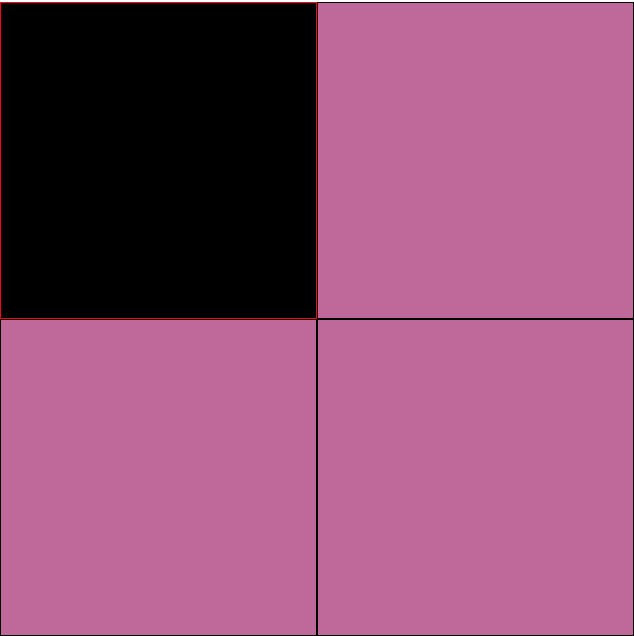
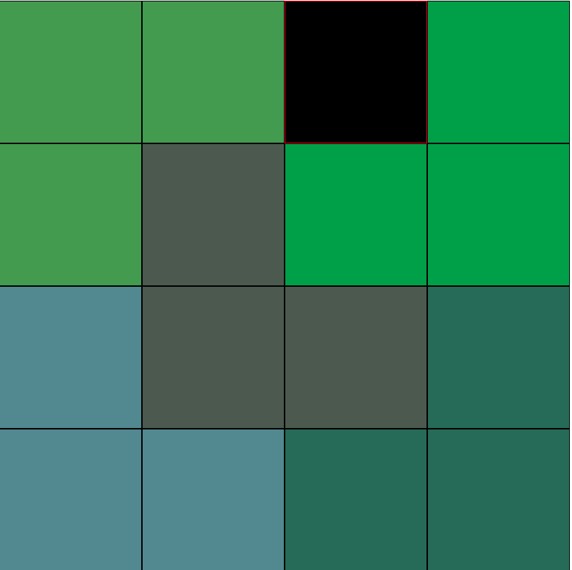
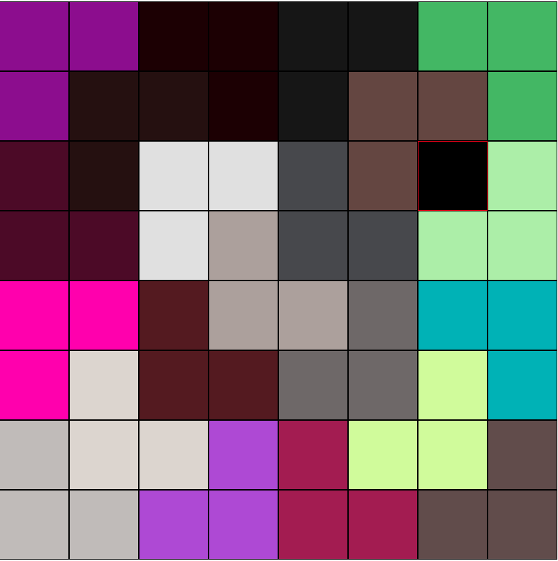

# The Defective Chessboard

Given an n x n chessboard, where n is a power of 2, and a single square is missing from the board, fill the board with L-Shaped tiles.

## Examples

Solution to 2x2 grid.


Solution to 4x4 grid.


Solution to 8x8 grid.


## Running this application

To run this visualization, you'll need NodeJS and npm installed on your machine. Clone this repository and from the project's folder, run:

```bash
$ npm install
$ npm start
```
